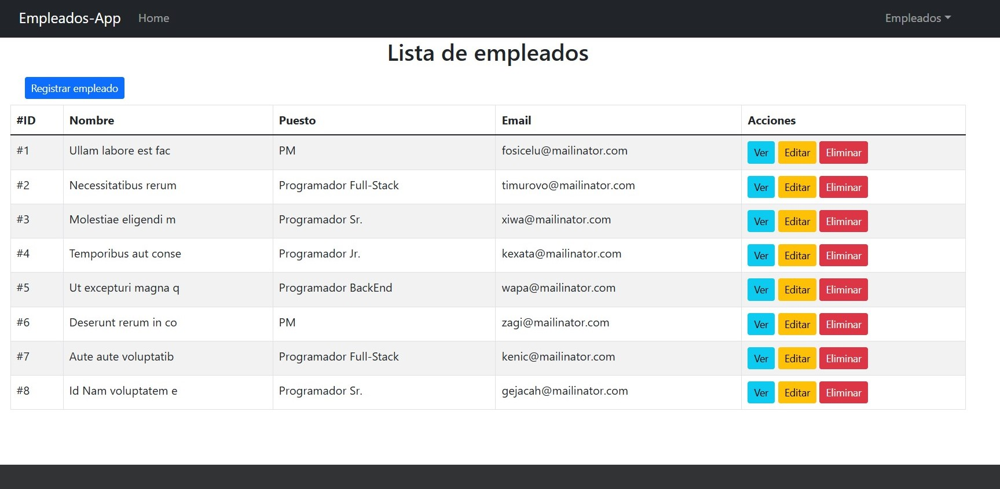
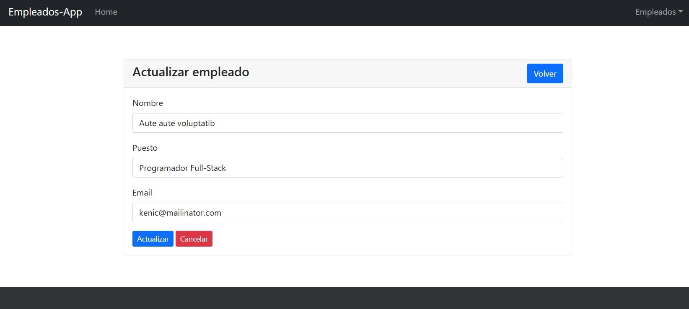
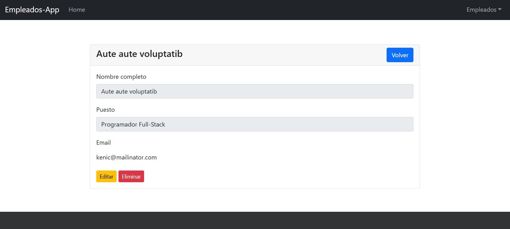
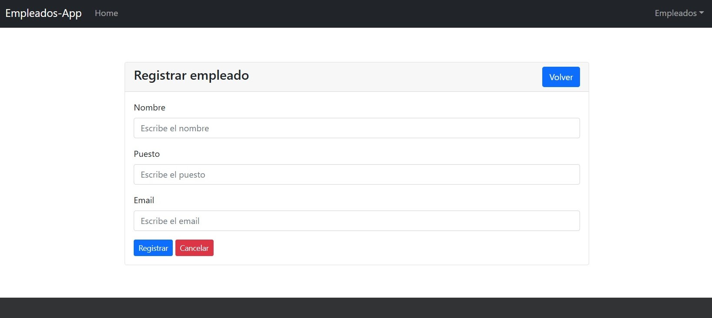
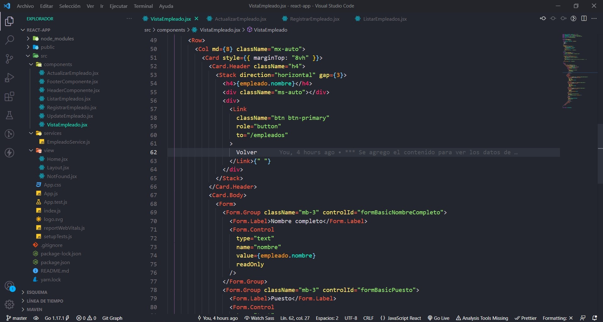
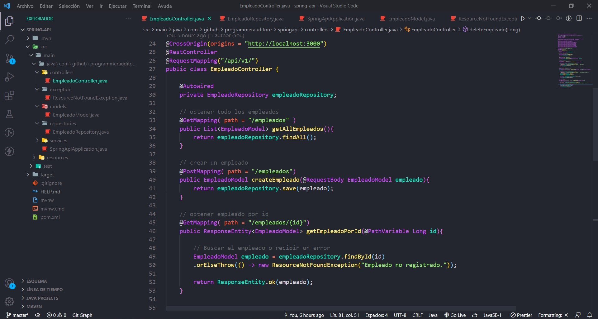

# App Full Stack

Este repositorio contiene un proyecto CRUD usando REACT JS + SPRING BOOT + MYSQL <br>
Además de incluir react-bootstrap, react-router, axios, etc.

# Requisitos

* Node v14.21.3
* npm v6.14.18
* jdk v17.0.2
* jre v17.0.11
* MySQL v5.7

Depedencias:

* axios ^0.24.0
* bootstrap ^5.1.3
* react ^17.0.2
* react-bootstrap ^2.0.3
* react-dom ^17.0.2
* react-router-dom ^6.0.2
* react-scripts 4.0.3
* web-vitals ^1.0.1

# Arrancar FrontEnd (ReactJS)

Para arrancar el sistema de forma local siga los siguientes pasos:

* Paso 1) Ejecutar el sig. comando para instalar las dependencias para ReactJs.

```shell
$ npm install
```

* Paso 2) Ejecutar el sig. comando para arrancar la aplicación de ReactJS

```shell
$ npm start
```

# Arrancar BackEnd (SpringBoot)

Para arrancar el sistema de forma local siga los siguientes pasos:

* Paso 1) Ejecutar el sig. comando para instalar las dependencias para Maven.

```shell
$ mvn clean install
```

* Paso 2) Ejecutar el sig. comando para arrancar la aplicación de ReactJS

```shell
$ mvn spring-boot:run
```

# Preview Table Database


# Previews











